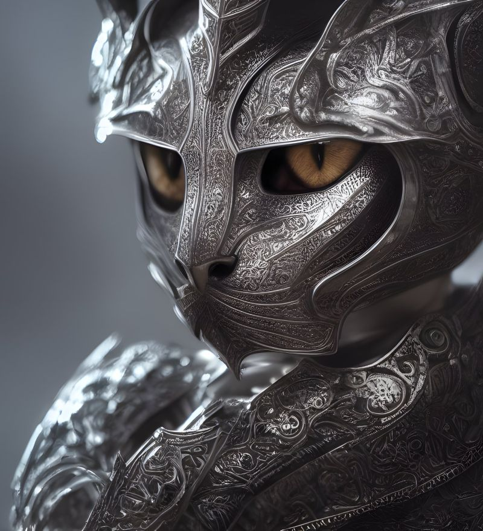

# Welcome! 😄 

**Caption:** This is generated🙀 using stable diffusion with the prompt: *"kneeling cat knight, portrait, finely detailed armor, intricate design, silver, silk, cinematic lighting, 4k"*, [credit](https://hostux.social/@valere/108939000926741542)

#### About Me:
👷🏻‍♀️ I'm a computer science student who loves to build things. 

🤓 Technology and cats are what I live for (refer to the picture above 😅).

✍🏻 Feel free to fork or use my codes. I always document and/or comment my codes so that everything is crystal clear. 

📫 To reach me, you can email me at: parisa.rabbany.pr@gmail.com

#### Here is a summary of my gitHub activity:

ps. Jupiter notebooks are all in Python3.

