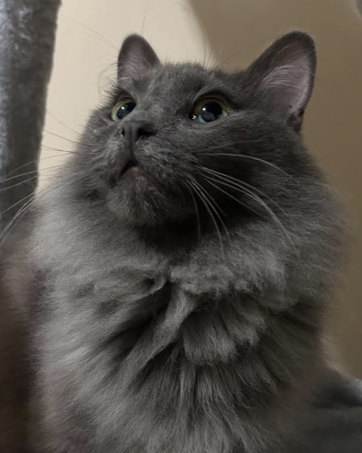

# Welcome! 😄

## About Me

👩🏻‍💻 I'm a CS PhD candidate at UIUC's [Conversational AI Lab](https://uiuc-conversational-ai-lab.github.io/), advised by [Prof. Dilek Hakkani-Tür](https://scholar.google.com/citations?hl=en&user=GMcL_9kAAAAJ&view_op=list_works&sortby=pubdate).

🔬 My research focuses on LLM alignment, evaluation, and safety — figuring out when, how, and why language models become sycophant, biased, or deceptive, and how to fix them.

📫 Reach me at: **rabbani8@illinois.edu**

🌐 [Website](https://ladypary.webflow.io) · [Google Scholar](https://scholar.google.com/citations?user=cwlvsZUAAAAJ&hl=en) · [LinkedIn](https://www.linkedin.com/in/parisa-rabbani-b90a321b4/)

## Recent Research

🗣️ **[DialDefer](https://drive.google.com/file/d/161ee7lYGUQdem3SKyHdNaRRzUSdQ_02i/view)** — measuring LLM judgment shift based on who's talking, not what's being said

💬 **[From Fact to Judgment](https://arxiv.org/abs/2511.10871)** — investigating task framing effects on LLM conviction (IWSDS'26)

---
*My baby Blu 🐱*

